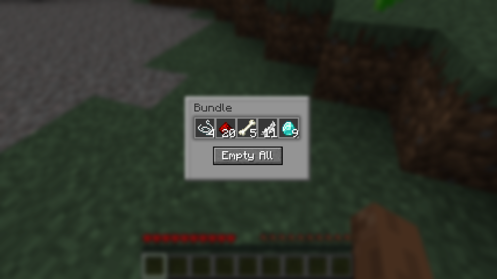

# Bundle Browser

A client-side Fabric mod that provides a grid UI for viewing and extracting items from bundles.



## The Problem

Vanilla bundles use a FILO (First In, Last Out) system - you can only extract the most recently added item. Want to grab something from the middle? You have to pull everything out one by one.

## The Solution

Bundle Browser lets you **right-click any bundle in your inventory** to open a chest-like grid view of its contents. Click any item to extract it directly, or use the "Empty All" button to dump everything at once.

## Features

- **Chest-like UI** - Familiar container styling that feels native to Minecraft
- **Direct item selection** - Click any item in the bundle to extract it
- **Empty All button** - Quickly dump all items to your inventory
- **Client-side only** - Works on any server, no server-side installation needed

## Installation

1. Install [Fabric Loader](https://fabricmc.net/use/installer/) for Minecraft 1.21.4
2. Install [Fabric API](https://modrinth.com/mod/fabric-api)
3. Download Bundle Browser and place it in your `mods` folder

## Usage

1. Open any container or your inventory
2. Right-click on a non-empty bundle
3. Click items to extract them, or use "Empty All"
4. Press ESC or your inventory key to close

## Requirements

- Minecraft 1.21.4
- Fabric Loader 0.16.0+
- Fabric API

## Building from Source

```bash
./gradlew build
```

The built JAR will be in `build/libs/`.

## License

MIT License - see [LICENSE](LICENSE) for details.
